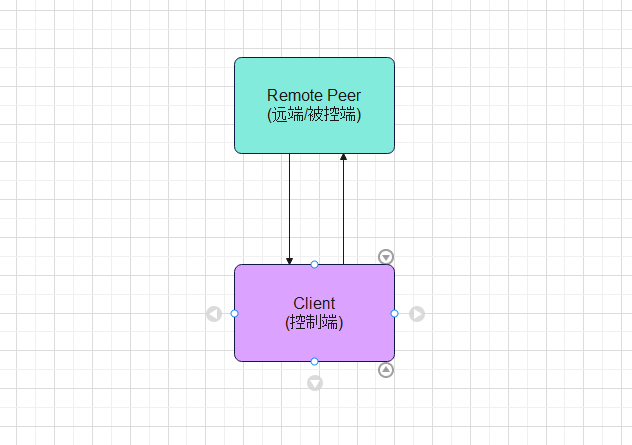

## Welcome to GoDesk Docs

> For more information, please visit [Official Website](http://www.godesk.uk).

#### 1. About Product
> Remote operation of computers, cloud gaming, emulator gamepad, similar to ToDesk, Sunflower, RustDesk, TeamViewer tools

#### 2. Software Status
✅ Ready  
⏳ In Development

| Platform | Controller | Controlled |
|----------|-----------|------------|
| Windows  | ✅         | ✅          |
| Android  | ✅         | ⏳          |

#### 3. CMS Backend

| Platform | Status |
|----------|--------|
| Windows  | ✅      |
| Linux    | ✅      |

#### 4. Work Mode
##### 4.1 Connect Directly

##### 4.2 Connect By Manager + Connect Directly

#### 5. License
> Free for personal use, do not use for commercial purposes without permission. If you have commercial needs, please contact us.
