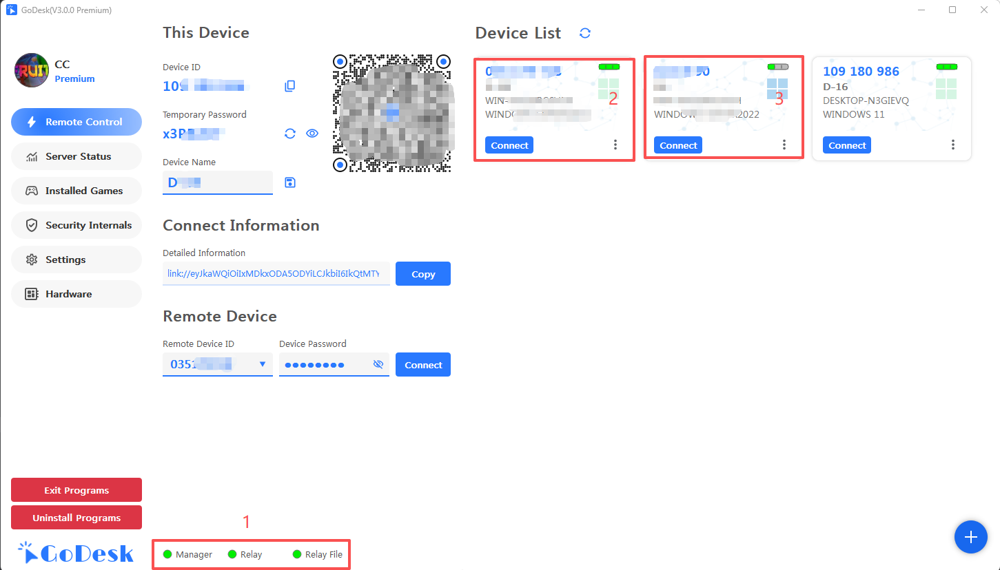

#### 1. Common Statuses

##### 1.1 ===> **1** Position
> If green, it shows connected to the management backend; red means not connected, or direct connection is used without needing connection

##### 1.2 ===> **2** Position
> The first green block indicates you can directly connect to this machine  
> The second and third indicate you can connect to the management backend, using the backend to relay data

##### 1.3 ===> **3** Position
> Only the first block is green, indicating you can only directly connect to this machine, cannot use relay service. There may be 2 situations:  
> 1. This machine is connected using IP directly  
> 2. This machine cannot connect to the management backend
