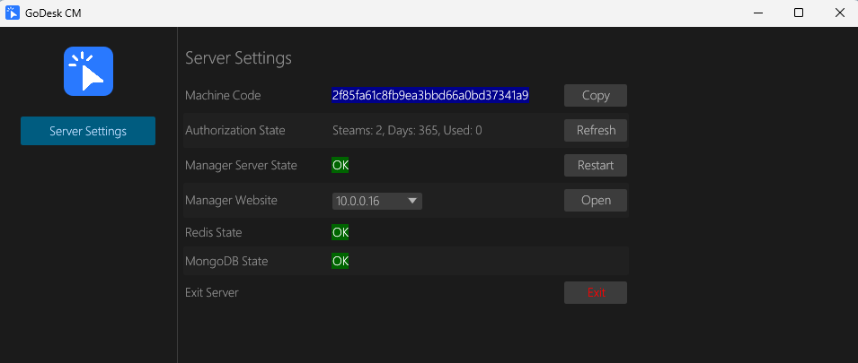

#### 1. Install Redis Service
##### 1.1 Windows Platform
> a. Visit [Github](https://github.com/redis-windows/redis-windows/releases) to download and install  
> Or  
> b. Direct [download](https://pan.quark.cn/s/1d65239af04c) to install
##### 1.2 UBUNTU Linux Platform
> apt install redis-server -y

#### 2. Install MongoDB
##### 2.1 Windows Platform
> Visit [Official Site](https://www.mongodb.com/try/download/community-kubernetes-operator) to download and install  
> Or   
> b. Direct [download](https://pan.quark.cn/s/1d65239af04c) to install

##### 2.2 UBUNTU Linux Platform
> Install according to [Official Documentation](https://www.mongodb.com/zh-cn/docs/v8.0/tutorial/install-mongodb-on-ubuntu/)

#### 3. Start GoDeskServer
> After installing GoDeskServer_xxx, simply start it

