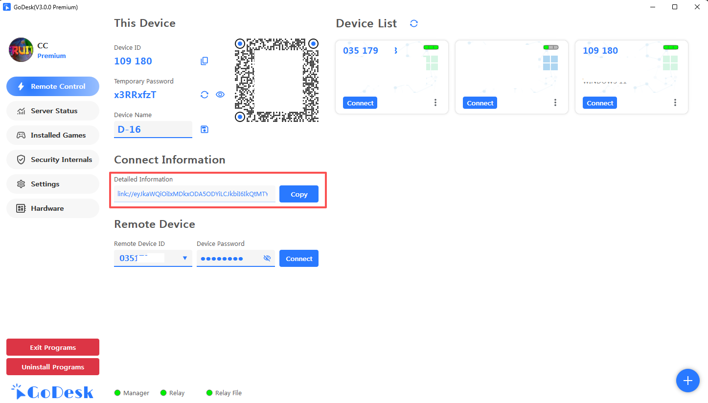
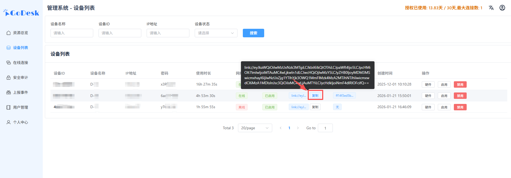
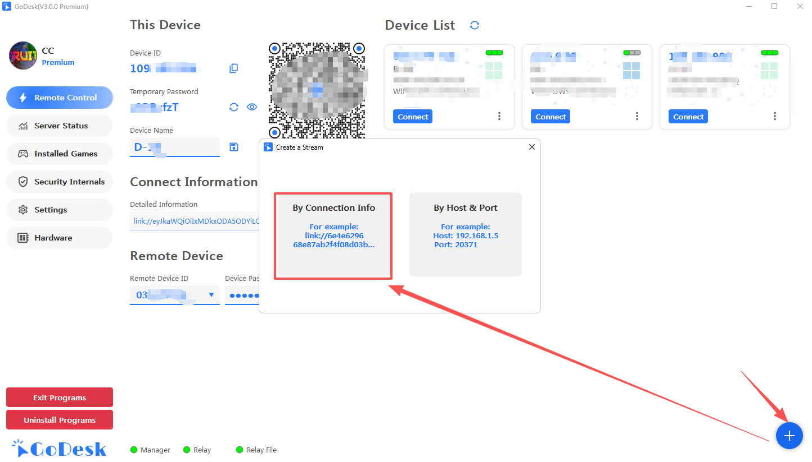
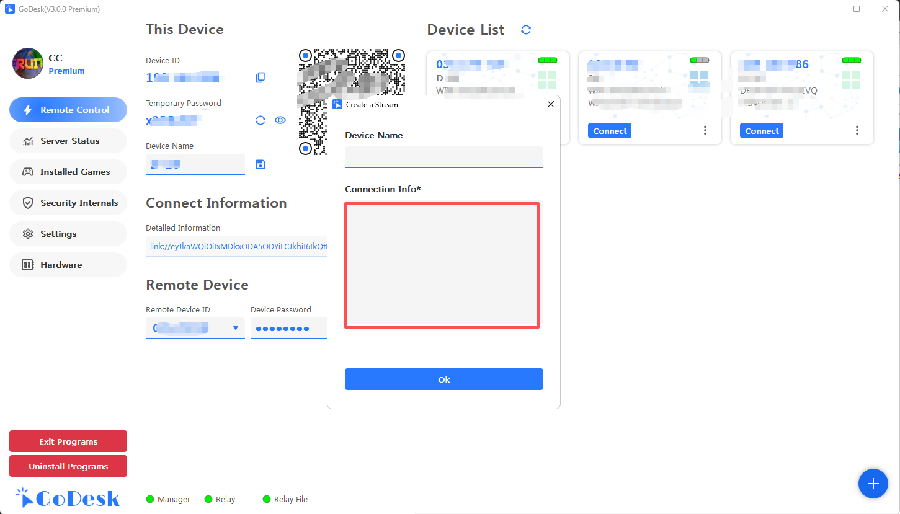

#### 1. Copy Remote Connection Info
> You can copy connection info from 2 places, the content is the same
##### 1.1 Copy from Remote Client

##### 1.2 Copy from Management Backend

##### 1.3 Enter the connection info in the client, click OK to connect

