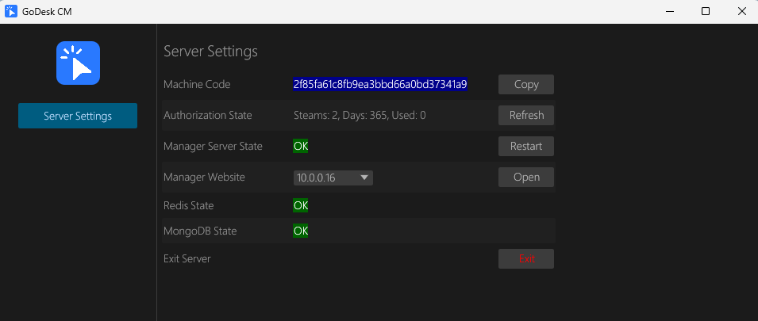

# 管理端环境配置

#### 1. 安装Redis服务
##### 1.1 Windows平台
> a. 访问[Github](https://github.com/redis-windows/redis-windows/releases)下载安装  
> 或者  
> b. 直接[下载]()安装
##### 1.2 UBUNTU Linux平台
> apt install redis-server -y

#### 2. 安装MongoDB
##### 2.1 Windows平台
> 访问[官网](https://www.mongodb.com/try/download/community-kubernetes-operator)下载安装  
> 或者   
> b. 直接[下载]()安装

##### 2.2 UBUNTU Linux平台
> 根据[官方说明](https://www.mongodb.com/zh-cn/docs/v8.0/tutorial/install-mongodb-on-ubuntu/)安装

#### 3. 启动GoDeskServer
> 安装GoDeskServer_xxx后，启动即可

