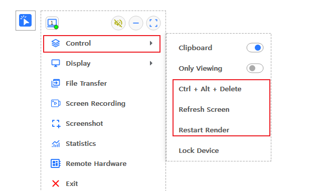
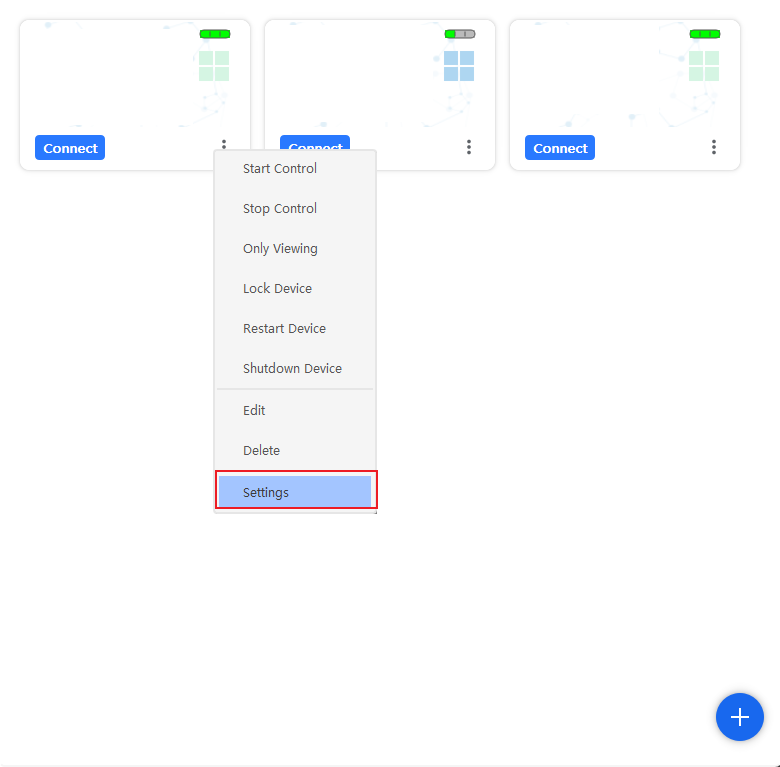
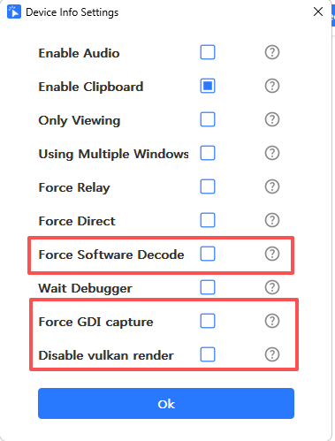

#### 1. 若您连接后无法看到画面
##### 1.1 尝试等待几秒，可能画面静止，没有触发采集
##### 1.2 若您看到的是黑色画面，尝试触发一下Ctrl+Alt+Delete，或者Refresh Screen，或者Restart Render

##### 1.3 若渲染有问题，花屏，尝试在设置中强制软件解码(Force Software Decode), 若对方机器比较老旧，可强制GDI采集(Force GDI capture), 若您的客户端机器比较老旧，可关闭Vulkan渲染(Disable Vulkan render)

